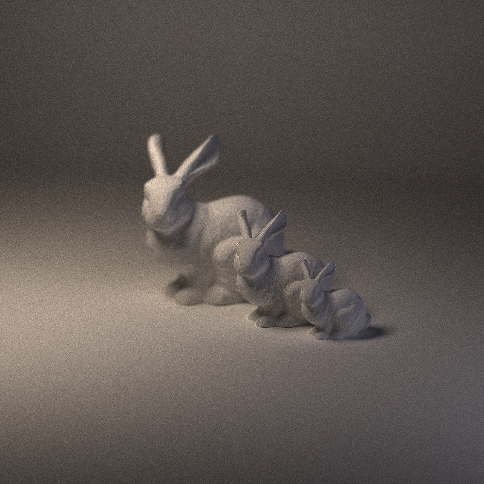
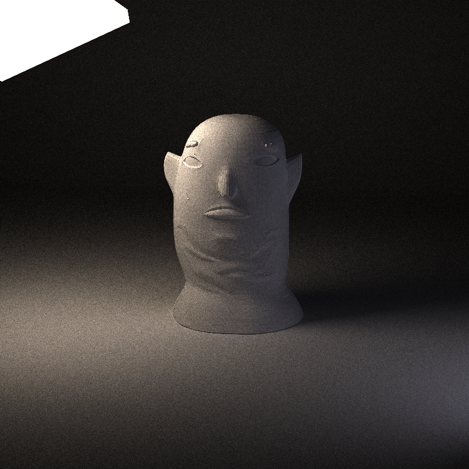
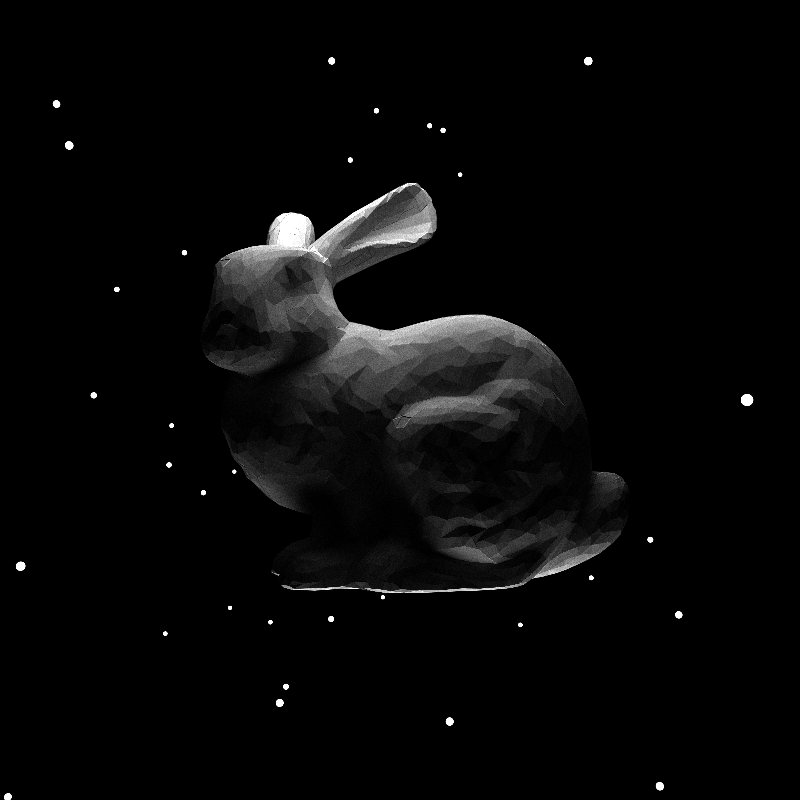
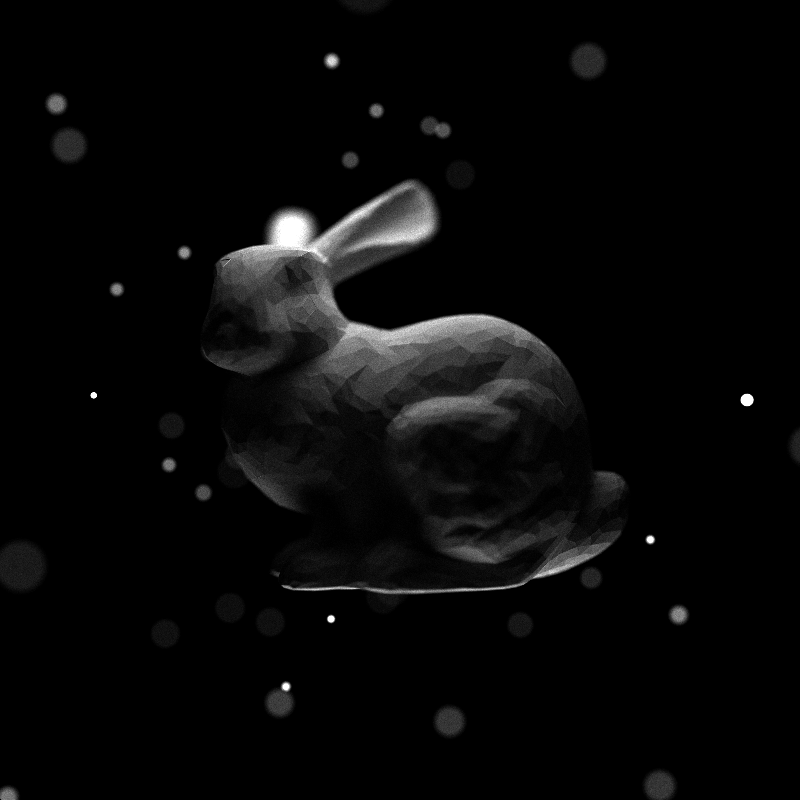
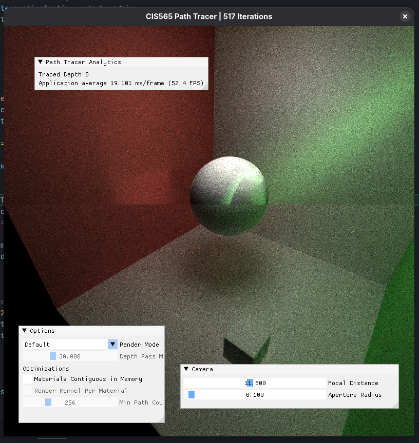

# CUDA Path Tracer



**University of Pennsylvania, CIS 5650: GPU Programming and Architecture, Project 3**

* Thomas Shaw
  * [LinkedIn](https://www.linkedin.com/in/thomas-shaw-54468b222), [personal website](https://tlshaw.me), [GitHub](https://github.com/printer83mph), etc.
* Tested on: Fedora 42, Ryzen 7 5700x @ 4.67GHz, 32GB, RTX 2070 8GB

## Features

### Arbitrary mesh loading

We use [tinyobjloader](https://github.com/tinyobjloader/tinyobjloader) to load arbitrary meshes from files. These are passed into the GPU as a device array of `Triangle`s, with indices and sizes passed in through the `GpuMesh` array.



### Adjustable camera depth of field (DOF)

By accurately simulating a pinhole camera, camera rays can be scattered to accurately mimic real phenomena like depth of field.

| DOF off | DOF on |
| --- | --- |
|  |  |

The focal distance and aperture radius are adjustable in both the scene file and the viewport.

### Bounding Volume Hierarchy (BVH)

To improve performance, we pre-process the scene into a hierarchical structure of axis-aligned bounding boxes. When traversing rays through the scene, we navigate this tree structure instead of iterating through all triangles. For scenes with a high polygon count, this is a huge boost to performance.

#### Approx. time per sample (lower is better)

| | Mesh BVH off | Mesh BVH on | % Difference |
| --- | --- | --- | --- |
| Bunny Scene (Diffuse) | 900ms | 345ms | -62% |
| Bunny Scene (Normals) | 315ms | 60ms | -81% **!!** |
| Cornell Monkeys (Diffuse) | 285ms | 190ms | -33% |
| Cornell Monkeys (Normals) | 55ms | 8.5ms | -85% **!!** |
| Cornell Icosahedron (Diffuse) | 22ms | 25ms | +12% |
| Cornell Icosahedron (Normals) | 7ms | 7ms | Negligible |

Note that simpler scenes with less polygons sometimes run slower with BVH enabled, due to the added overhead.

### Quality-of-Life Features

#### Debug passes

Although a post-processing pipeline has not yet been implemented to support these, the pathtracer has a number of options that can be toggled to 

#### Devcontainer support

To allow for reproducible builds and better overall DX, I've added configuration files to support [devcontainers](https://containers.dev/). 

Although this will still require an NVIDIA GPU and some configuration, specifically the NVIDIA container runtime, it can reduce the bloat of installing one-time tooling for projects that you might later forget to remove.

It also comes with a clangd language server installed by default, and the VSCode extension along with it.


## Usage

### Through a devcontainer (recommended)

Ensure you have the NVIDIA container runtime set up and enabled in Docker. If on Linux, you may also have to run:

```sh
xhost +local:docker
```

Then, open the folder in a VSCode devcontainer.

There are two run/debug configurations, one for **Debug** and one for **Release**. Select one and run. The binary will be automatically built and run with the default scene.

To load a custom scene, provide it as a CLI argument. For example:

```sh
./build/bin/cis565_path_tracer ./scenes/mesh_showoff.json
```


### Directly on machine

Ensure you have CUDA-compatible drivers. The following dependencies are also required:

- CUDA toolkit
- GLEW
- GLFW3

And of course CMake and some C/CXX compiler.

Once successfully built, use the run/debug configurations as seen in the devcontainer guide.


### Configuration

Camera properties, scene layout, and file output can be adjusted in each `scene.json` file in `scenes`.

To disable optimizations like mesh-level BVH generation, find line 166 in `src/scene.cpp`, and change `#define ENABLE_TRI_NODES true` to `false`.


## Third-Party Libraries

- [tinyobjloader](https://github.com/tinyobjloader/tinyobjloader)


## Bloopers

Silly BVH business:

